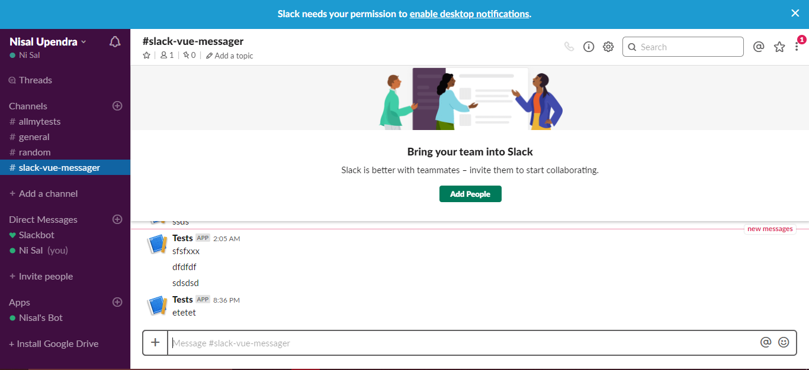
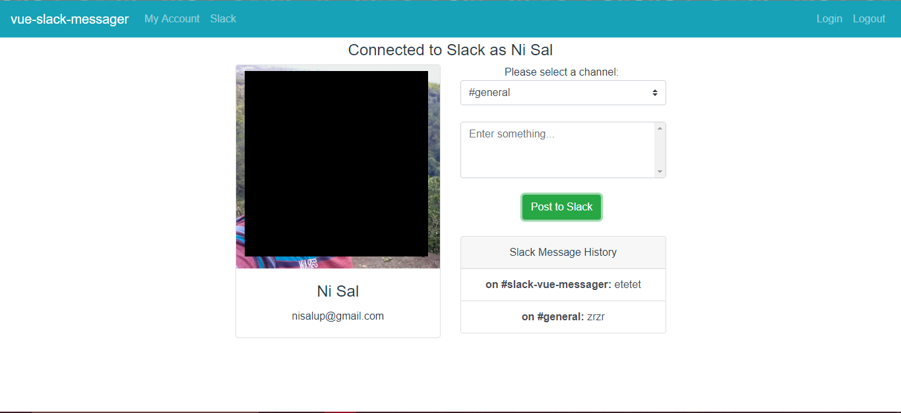
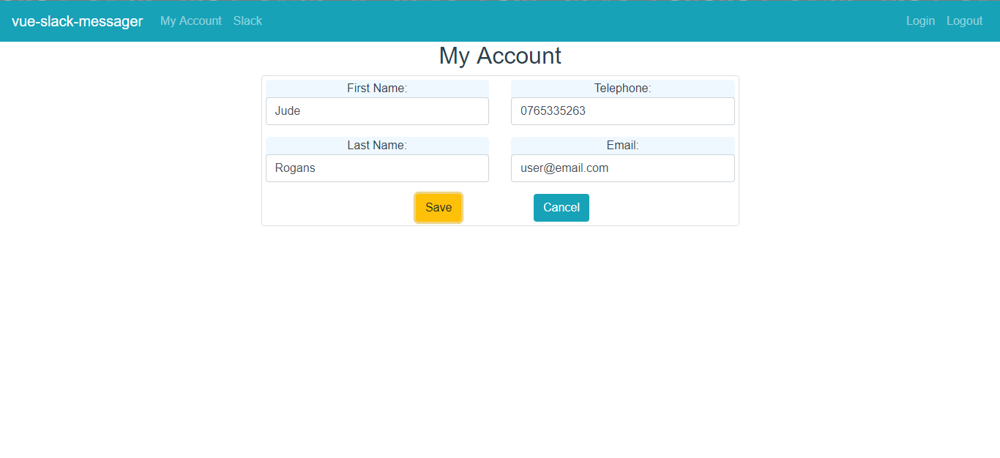
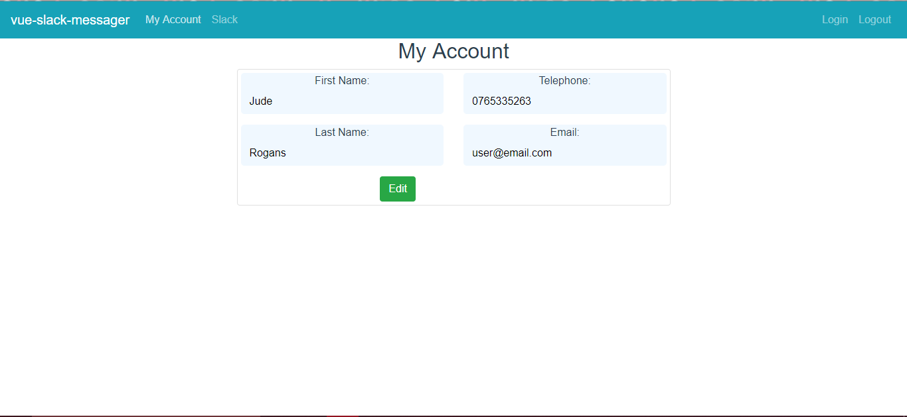
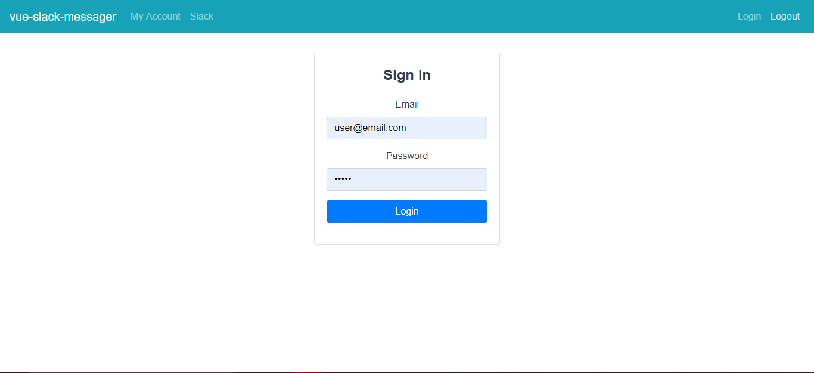

# vue-slack-messager
This application permits users to do the following.
1) Login via a given username and password (no db attatched)
2) Edit their personal information
3) Login via slack and post messages to a selected channel

## Technologies
1) the frontend is implemented in VueJS.
2) the backend is implemented in nodeJS.

## Setting it up
A .env file is needed in the /backend root folder in the following format.

```bash
SLACK_TOKEN=xxx
CLIENT_ID=xxx
CLIENT_SECRET=xxxx
```

These can be obtained at https://api.slack.com/apps by creating your own app.

You will need node and npm installed to run this application
After checking out the repo, to run the frontend, use the following command to start the backend:

```bash
nodemon index.js (for debugging)
```
or
```bash
node index.js
```

For the frontend:

```bash
npm start
```
or
```bash
npm run dev
```
## Login
username: user@email.com    test@vizir.co
password: password          testVizir2019

## Known issues
1) VueJS routing: It's messed up and I didn't have time to fix it. After logging in via slack, you have to click the slack menu link to view the details, otherwise it will redirect to the login. 

2) As there is no DB used, I cannot persist data in the backend, except for session data. As a consequence, I ridrect from slack to the front end, and send that code to the backend, which will obtain the access code and other data.
Of course, ideally, the access codes should be saved in the backend, and the slack redirect should head to the backend as well.

## Screenshots











## Me
Nisal [Linkedin](https://linkedin.com/in/nisalup/), nisalup@gmail.com
